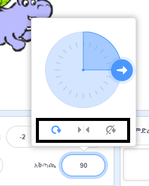

ባህሪ ወዴት እንደሚሽከረከር መወሰን ይችላሉ።

- በ **Sprites** ፓነል ላይ ስፕራይት የሚለውን ጠቅ ያድርጉ።

- አቅጣጫውን ይጫኑ እና የሚፈልጉትን አዙሪት አይነት ይምረጡ።

ቅጦቹ እነኚህ ናቸው ፦

- በመላው ዙሪያ - የባህሪውን ፊት አቅጣጫ ያመለክታል
- ግራ / ቀኝ - ባህሪውን ወደ ግራ ወይም ቀኝ ብቻ ያዞራል
- አይሽከርከር - ባህሪው ፊት በሁሉም አይነት አቅጣጫ ተመሳሳይ ነው