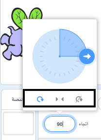

يمكنك ضبط طريقة دوران الكائن.

- أنقر على الكائن الموجود في قائمة **الكائنات**.

- أنقر على الاتجاه واختار نمط الدوران الذي تريده.

الأنماط هي:

- دوران كامل — يقوم بتوجيه الكائن للمكان الذي يواجهه
- يسار/ يمين — يغير اتجاه الكائن إلى اليمين أو إلى السار فقط
- عدم الدوران — يظل الكائن كما هو مهما كان اتجاهه