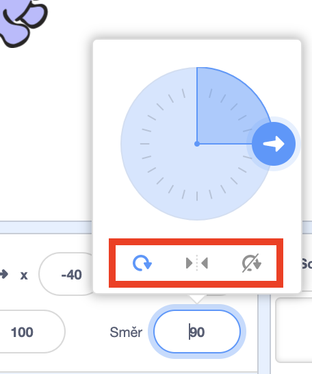

Můžeš určit, jakým způsobem se postava otáčí.

- Klikni na ikonku postavy na panelu **Postav**.

- Klikni na políčko směr a vyber požadovaný styl otáčení.

Styly jsou:

- Dokola - postava se pootočí podle toho kam směřuje
- Vlevo/vpravo - postava se pouze převrací vlevo nebo vpravo
- Neotáčet - otoční postavy ne nezmění bez ohledu na to, kam směřuje