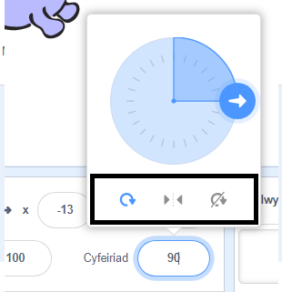

Gelli di ddewis sut mae'r corlun yn troi.

- Clicia'r corlun yn y panel **Corlun**.

- Clicia ar y cyfeiriad a dewis y math o droelli rwyt ti ei eisiau.

Dyma'r steiliau:

- Cylchdro llawn - pwyntio'r ciplun at y cyfeiriad y mae'n ei wynebu
- Chwith i dde - trosi y ciplun i'r dde neu i'r chwith yn unig
- Dim cylchdroi - mae'r corlun yn edrych yr un ffordd, ni waeth beth fo'r cyfeiriad y mae'n ei wynebu