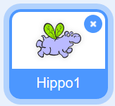
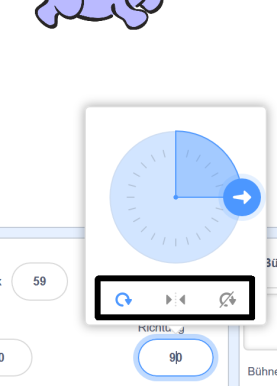

Du kannst festlegen, wie sich eine Figur dreht.

- Klicke im **Figuren** Bereich auf die auszurichtende Figur.

- Klicke auf die Richtung und wähle die gewünschte Rotationsart.

Diese Rotationsarten stehen zur Wahl:

- Rundherum - die Figur dreht sich in die Richtung, in die sie zeigt
- Links/Rechts - dreht die Figur nur nach links oder rechts
- Nicht drehen - die Figur sieht immer gleich aus, egal in welche Richtung sie zeigt