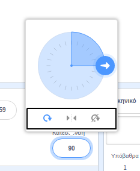

Μπορείς να ορίσεις το πως περιστρέφεται ένα αντικείμενο.

- Κάνε κλικ στο αντικείμενο, στο πλαίσιο **Αντικείμενα**.

- Κάνε κλικ στην κατεύθυνση και επέλεξε το στυλ περιστροφής που θέλεις.

Τα στυλ είναι:

- Πλήρης περιστροφή: στρέφει το αντικείμενο στην κατεύθυνση που βλέπει
- Αριστερά/Δεξιά: στρέφει το αντικείμενο αριστερά ή δεξιά μόνο
- Χωρίς περιστροφή: το αντικείμενο φαίνεται το ίδιο ανεξάρτητα από την κατεύθυνση στην οποία βλέπει