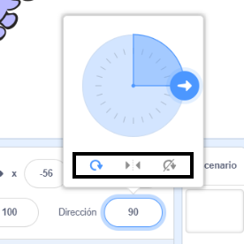

Puedes establecer en qué sentido rota un sprite.

- Haz clic en el sprite en el panel de ** Sprites **.

- Haz clic en la dirección y selecciona el estilo de rotación que deseas.

Los estilos son:

- Giro completo — gira el sprite en la dirección hacia la que está mirando
- Izquierda/Derecha — gira el sprite hacia la izquierda o hacia la derecha
- No rotar — el sprite se ve igual, independientemente de la dirección hacia la que está mirando