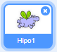
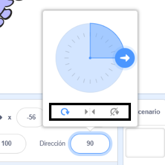

Puedes establecer en qué sentido rota un objeto.

- Haz clic en el objeto en el panel de **Objetos**.

- Haz clic en la dirección y selecciona el estilo de rotación que deseas.

Los estilos son:

- Giro completo — gira el sprite en la dirección hacia la que está mirando
- Izquierda/derecha: gira el objeto hacia la izquierda o derecha solamente
- No rotar: el objeto se ve igual, independiente de la dirección hacia la que está mirando