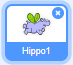
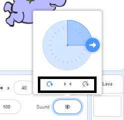

Võid määrata spraidi pöörlemissuuna.

- Klõpsa spraidil **Spraitide** paneelis.

- Kliki suunal ja vali soovitud pöörlemisstiil.

Stiilid on:

- Saab pöörata igas suunas - osutab spraidi selles suunas, mille poole too näoga on
- Vasakule/paremale - sprait pöördub ainult vasakule või paremale
- Ei pöörata - sprait näeb välja samasugune, hoolimata suunast, mille poole see näoga on