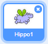
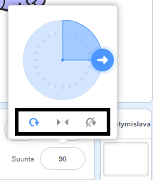

Voit asettaa tavan, jolla hahmoa kierretään.

- Napsauta hahmoa **Hahmot** -paneelissa.

- Napsauta suuntaa ja valitse haluamasi kiertotyyli.

Tyylit ovat:

- Joka suuntaan — hahmo on kohdistettu siihen suuntaan, johon se osoittaa
- Vasen/Oikea — kääntää hahmoa vain vasemmalle tai oikealle
- Älä kierrä — hahmo näyttää samalta riippumatta siitä mihin suuntaan se osoittaa