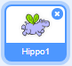

आपका स्प्राइट किस दिशा में घूमे यह आप निर्धारित कर सकते हैं।

- **Sprites** पैनल में स्प्राइट पर क्लिक करें।

- दिशा पर क्लिक करें और अपनी इच्छा अनुसार दिशा शैली चुनें।

शैलियों हैं:

- चरों ओर — स्प्राइट को उस दिशा में घुमाना जिस दिशा में वो है
- बाएँ/दाएँ — स्प्राइट को केवल बाएँ या दाएँ की तरफ घुमाना
- न घूमना — स्प्राइट एक ही तरह का दिखेगा भले वो किसी भी दिशा में घूमा हुआ हो