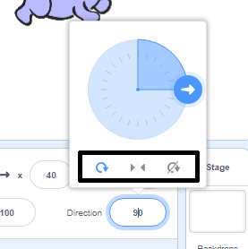

आपका स्प्राइट किस दिशा में घूमे यह आप निर्धारित कर सकते हैं।

- **स्प्राइटस(Sprites)** पैनल में स्प्राइट पर क्लिक करें।

- दिशा(Direction) पर क्लिक करें और अपनी इच्छित घुमाव शैली चुनें।

शैलियों हैं:

- पूरा घुमाव — स्प्राइट को सामने की दिशा में इंगित करता है
- बाएँ/दाएँ — स्प्राइट को केवल बाएँ या दाएँ की तरफ फ्लिप करता है
- न घूमना — स्प्राइट वैसा ही दिखाई देता है चाहे इसका चेहरा किसी भी दिशा में हो