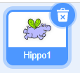

Možeš podesiti u kojem smjeru se lik rotira.

- Klikni na lika na kartici **Likovi**.

- Klikni na smjer i odaberi željeni način rotacije.

Stilovi su:

- Na sve strane — usmjerava lika u smjeru u kojem je okrenut
- Lijevo/Desno — okreće lika samo lijevo ili desno
- Bez okretanja — lik izgleda isto, bez obzira u kojem smjeru je okrenut