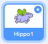
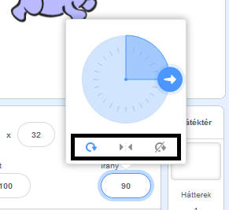

Beállíthatod, hogy a szereplő hogyan forduljon el.

- Kattints a szereplőre a **Szereplők** panelen.

- Kattints az irányra, majd válaszd ki a kívánt forgási stílust.

A stílusok:

- Mindenfelé - a szereplő arra fordul, amerre néz
- Balra-jobbra - csak balra vagy jobbra fordítja a szereplőt
- Nem foroghat - a szereplő mindig ugyanúgy néz ki, függetlenül attól, hogy melyik irányba néz