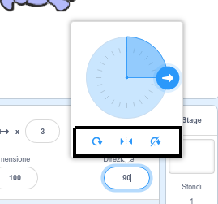

È possibile impostare il modo in cui uno sprite ruota.

- Clicca sullo sprite nel **pannello** degli sprite.

- Fare clic sulla direzione e seleziona lo stile di rotazione desiderato.

Gli stili sono:

- Può Ruotare: punta lo sprite nella direzione verso cui è rivolto
- Sinistra/Destra - ribalta lo sprite solo a sinistra o a destra
- Non ruotare: lo sprite resta lo stesso indipendentemente dalla direzione verso cui è rivolto