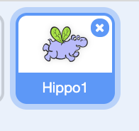
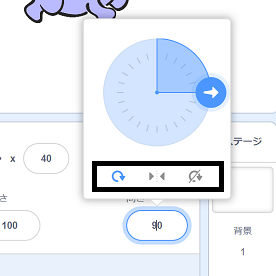

スプライトの回転方法を設定できます。

- Click on the sprite in the **Sprites** panel.

- Click on the direction and select the rotation style you want.

スタイルは次の通りです。

- All around — points the sprite in the direction it is facing
- Left/Right — flips the sprite left or right only
- Do not rotate — the sprite looks the same regardless of which direction it is facing