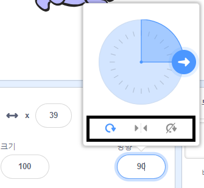

스프라이트를 회전하는 방법을 설정할 수 있습니다.

- **Sprite** 패널에서 스프라이트를 클릭하십시오.

- 방향을 클릭하고 원하는 회전 스타일을 선택하십시오.

다음과 같은 스프라이트 회전 방법들을 사용할 수 있습니다.

- 모든 방향 - 스프라이트가 바라보는 방향을 향하게 합니다.
- 왼쪽 / 오른쪽 - 스프라이트를 왼쪽이나 오른쪽으로 뒤집기만 합니다.
- 회전하지 않음 - 스프라이트는 바라보는 방향에 관계없이 동일하게 보입니다.

커뮤니티 기여 번역

이 프로젝트는 강정주 가 번역하였고 홍주희 가 검토하였습니다.

우리의 놀라운 번역 자원 봉사자들은 전 세계의 어린이들에게 코딩을 배울 수 있는 기회를 제공합니다. 우리 프로젝트 번역에 참여하여 더 많은 아이들에게 도움을 줄 수 있습니다. 자세한 내용은 [rpf.io/translators](https://rpf.io/translators)에서 확인하세요.