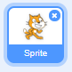
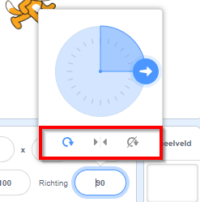

Je kunt de manier waarop een sprite draait instellen.

- Klik op de sprite in het **Sprites** paneel.

- Klik op de richting en selecteer de gewenste rotatiestijl.

De stijlen zijn:

- Volledige rotatie - richt de sprite in de richting waarin hij kijkt
- Links-rechts - richt de sprite alleen naar links of rechts
- Roteer niet - de sprite ziet er hetzelfde uit, ongeacht de richting waarin hij gaat