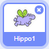
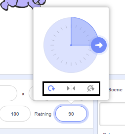

Du kan angi hvilken retning en figur skal peke.

- Klikk på figuren i **Figur-**panelet.

- Klikk på retningen og velg hvor den skal peke.

Valgene er:

- Fri rotasjon - peker figuren i den retningen den flytter seg
- Vend sideveis - Vender figuren til venstre eller høyre
- Ikke roter - figuren peker samme vei uansett hvilken retning den flytter seg