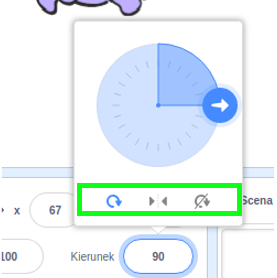

Możesz ustawić sposób obracania się postaci.

- Kliknij na duszka w panelu **Duszki**.

- Kliknij kierunek i wybierz styl obrotu, który chcesz.

Style to:

- Pełny obrót - ustawia duszka w kierunku, w którym jest zwrócony
- Lewo/prawo - odwraca duszka tylko w lewo lub w prawo
- Nie obracaj - duszek wygląda tak samo niezależnie od kierunku, w którym jest zwrócony