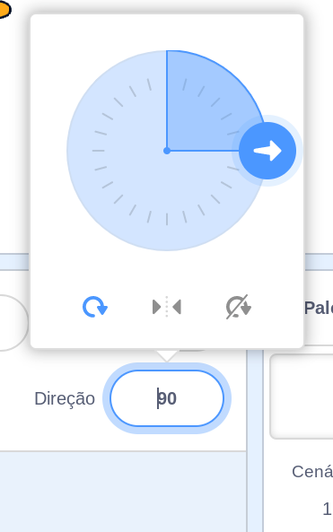

Você pode definir de que maneira um ator gira.

- Clique no sprite no painel **Sprites** .

- Clique na direção e selecione o estilo de rotação que você deseja.

Os estilos são:

- Tudo ao redor — aponta o sprite na direção que está voltado
- Esquerda / Direita - vire o sprite apenas para a esquerda ou para a direita
- Não gire - o sprite parece o mesmo, independentemente de qual direção ele está voltado