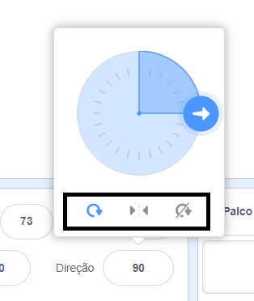

Podes definir a direção em que o actor gira.

- Clica no actor no painel **Actores**.

- Clica na direção e seleciona o estilo de rotação que quiseres.

Os estilos de rotaçāo são:
- Tudo ao redor - aponta o actor para a direção em que está voltado
- Esquerda / Direita - vira o actor apenas para a esquerda ou para a direita
- Não roda - o actor parece o mesmo independentemente da direção para que está voltado