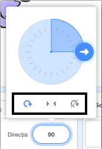

Poți stabili modul în care un personaj se rotește.

- Dă clic pe personaj în panoul de **Personaje**.

- Apasă pe direcție și selectează tipul de rotație dorit.

Modurile sunt:

- De jur împrejur - arată în ce direcție se îndreaptă personajul
- Stânga/dreapta - întoarce personajul numai spre stânga sau spre dreapta
- Nu roti - personajul arată la fel indiferent de direcția în care se indreaptă