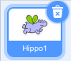
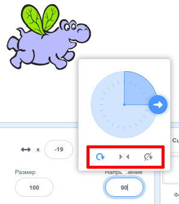

Вы можете настроить как будет вращаться спрайт.

- Кликни по спрайту в панели **Спрайтов**.

- Кликни по направлению и выбери нужный стиль вращения.

Стили:

- Кругом — вращает спрайт в ту сторону, в которую он смотрит
- Влево/направо — переворачивает спрайт только влево или только вправо
- Не вращать — спрайт не поворачивается независимо от его направления