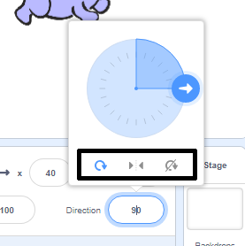

ඔබට sprite වල භ්‍රමන දිශාව සැකසිය හැකියි.

- **Sprites** පැනලයේ ඇති sprite මත ක්ලික් කරන්න.

- ඔබට අවශ්‍ය දිශාව මත ක්ලික් කර භ්‍රමන ශෛලිය තෝරන්න.

ශෛලියයන් වන්නේ:

- වටේට (All around) - sprite එක එය මුහුණලා අති දිශාවට යොමුකරයි.
- වමට / දකුණට (Left/Right) - sprite එක වම්පසට හෝ දකුණුපසට පෙරළන්න.
- භ්‍රමනය නොකරන්න (Do not rotate) - sprite එක කුමන අතට මුහුණලා තැබුවත් sprite එක ඒ ආකරයෙන්ම දිස්වේ.