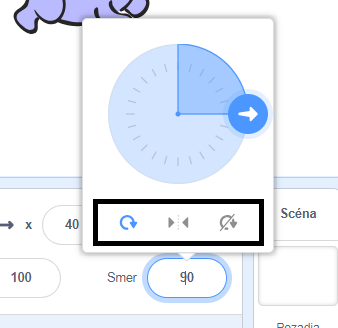

Tu nastaviš, akým spôsobom sa postava otočí.

- Kliknite na postavu na paneli s **Postavy**.

- Kliknite na smer a vyberte požadovaný štýl otáčania.

Štýly sú:

- Dokola - ukazuje postavu v smere, ktorým je otočená
- Vľavo-vpravo - len preklopí postavu doľava alebo doprava
- Neotáčaj - postava vyzerá rovnako bez ohľadu na smer akým je otočená