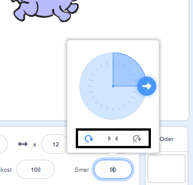

Nastaviš lahko, v katero smer se bo figura vrtela.

- Klikni na figuro v razdelku **Figure**.

- Klikni na smer in izberi želeni način vrtenja.

Slogi so:

- Na vse strani - figura se obrne v tiso smer, v katero gleda
- Levo / Desno - figura se obrne zgolj v levo ali desno
- Ne zasukaj - figura je videti vedno enako ne glede na smer v katero gleda