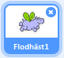
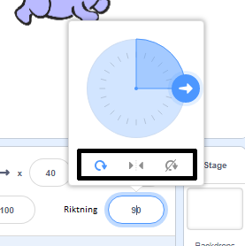

Du kan ställa in hur en sprajt roterar.

- Klicka på sprajten i **Sprites** panelen.

- Klicka på riktningen och välj önskad rotationsstil.

Stilarna är:

- Rotera - vänder sprajten i den riktning den tittar
- Vänster/Höger - vänder sprajten åt vänster eller höger
- Rotera inte - sprajten ser densamma ut oavsett vilken riktning den tittar