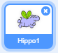
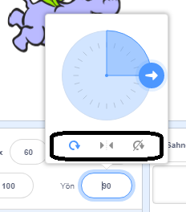

Bir kuklanın hangi şekilde döneceğini ayarlayabilirsiniz.

- **Kuklalar** panelindeki kuklanın üstüne tıklayın.

- Yön 'e tıklayın ve istediğiniz bir dönüş tarzını seçin.

Dönüş yönleri şunlardır:

- Her yöne dön — kuklanın dönmüş olduğu yönü işaret eder
- Sağa/Sola — kuklayı sadece sağa veya sola çevirir
- Döndürme — kukla hangi yöne döndürüldüğünden bağımsız ilk haline döner