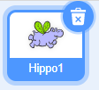
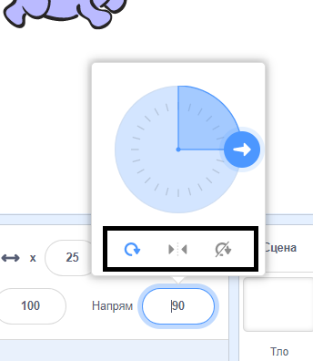

Ти можеш вказати, яким чином спрайт обертатиметься.

- Натисни на спрайт на панелі **Спрайти**.

- Натисни на напрям і вибери бажаний стиль обертання.

Стилі є такі:

- Навколо — направляє спрайт в обраному напряму
- Вліво/вправо — направляє спрайт лише вліво або вправо
- Не обертається — спрайт виглядає так само, незважаючи на те, який напрям обрано